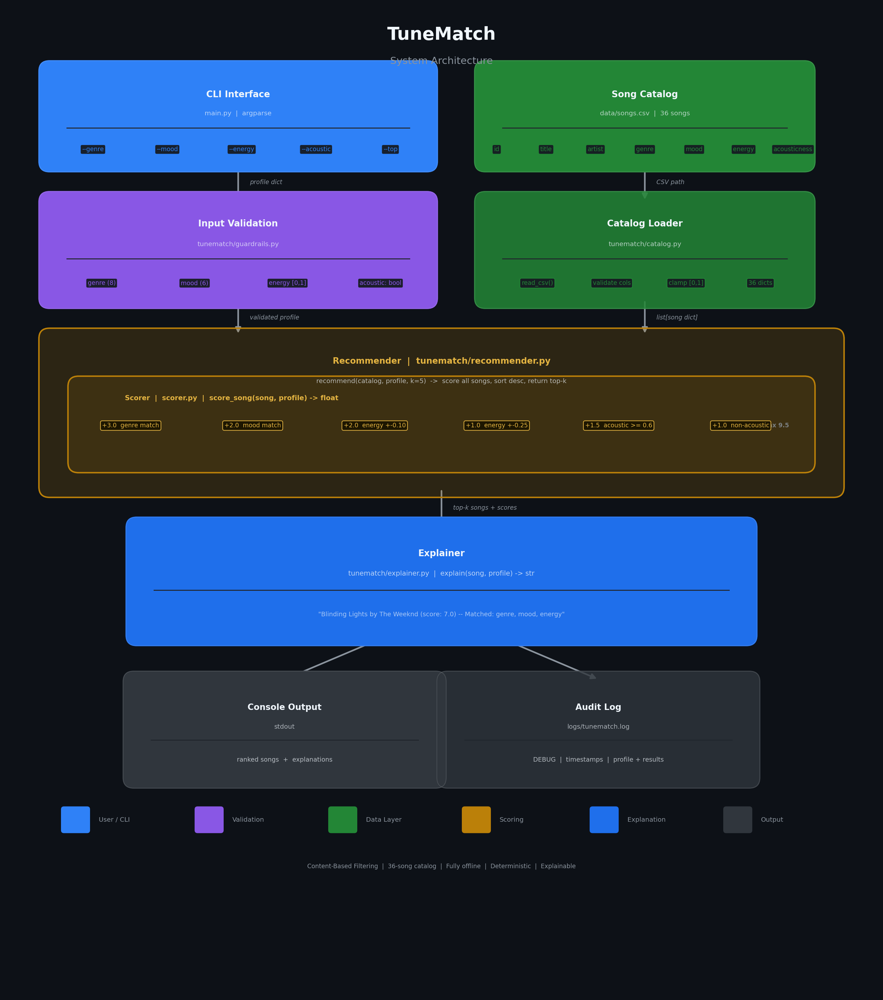

# TuneMatch

A content-based music recommender that scores every song in a catalog against your taste profile and returns ranked recommendations with plain-language explanations.


---

## Original Project

This system extends the **Module 2 Song Classifier**, a basic music recommender that loaded a 20-song CSV catalog and scored each track against three hardcoded user profiles using a simple weighted formula (genre +2.0, mood +1.0, energy proximity). The original system produced top-k recommendations with short explanations but had no input validation, no logging, and no CLI — it ran by editing constants directly in the source file.

---

## What TuneMatch Does

TuneMatch accepts a user taste profile via the command line, loads a 36-song catalog from CSV, and scores every song using a six-rule additive scoring engine. Songs are ranked by score and returned with a matched-rule explanation that tells you exactly why each track was recommended. Content-based filtering was chosen deliberately here: it works without any user history, is fully transparent (you can see exactly which rules fired), and produces consistent results that are easy to test and debug. The tradeoff is that it can never surface a song the user wouldn't have predicted — there is no serendipity, only agreement.

---

## System Architecture

TuneMatch is a linear pipeline: each stage produces clean output consumed by the next, with no shared state between modules.

```
CLI args -> validate_profile -> load_catalog -> score_song (x36) -> recommend (rank + slice) -> explain -> stdout
```

```
main.py
  |
  +-- guardrails.validate_profile()   validates genre, mood, energy, likes_acoustic
  |
  +-- catalog.load_catalog()          reads CSV, validates columns, clamps floats
  |
  +-- recommender.recommend()
  |     |
  |     +-- scorer.score_song()       called once per song (36 times)
  |
  +-- explainer.explain()             called once per top-k result
```


> _Diagram coming soon -- see `/assets` folder._

---

## Setup

```bash
git clone https://github.com/YOUR_USERNAME/applied-ai-system-final.git
cd applied-ai-system-final
pip install -r requirements.txt
```

---

## Usage

```
python main.py --genre GENRE --mood MOOD --energy FLOAT [--acoustic] [--top INT] [--catalog PATH]

Required:
  --genre     Preferred genre: pop, rock, lofi, edm, hiphop, jazz, metal, classical
  --mood      Target mood: happy, chill, intense, sad, energetic, romantic
  --energy    Target energy level, 0.0 to 1.0

Optional:
  --acoustic  Flag: prefer acoustic tracks (default: off)
  --top       Number of recommendations to return (default: 5)
  --catalog   Path to catalog CSV (default: data/songs.csv)
```

**Example:**

```bash
python main.py --genre pop --mood happy --energy 0.7
```

```
TuneMatch -- Top 5 Recommendations
------------------------------------------
1. Golden Hour by Priya Nair (score: 9.0) -- Matched: genre, mood, energy, non-acoustic
2. Honey Jar by Selena Voss (score: 9.0) -- Matched: genre, mood, energy, non-acoustic
3. Digital Hearts by LUNA (score: 7.0) -- Matched: genre, energy, non-acoustic
4. Crown Heights Anthem by Dre Solano (score: 6.0) -- Matched: mood, energy, non-acoustic
5. Electric Sunday by The Static (score: 5.0) -- Matched: genre, energy, non-acoustic
```

---

## Sample Interactions

**Profile 1 — Pop / Happy** (`--genre pop --mood happy --energy 0.7`)

```
1. Golden Hour by Priya Nair (score: 9.0) -- Matched: genre, mood, energy, non-acoustic
```

Genre and mood both match, energy is within 0.1 of the target (triggering both energy rules for +3 combined), and the low acousticness earns the non-acoustic bonus. This is the highest achievable score without the acoustic preference flag set.

---

**Profile 2 — Chill Acoustic Lofi** (`--genre lofi --mood chill --energy 0.3 --acoustic --top 3`)

```
1. Midnight Rain by The Velvet Moths (score: 9.5) -- Matched: genre, mood, energy, acoustic
2. Hammock Dreams by River Oak (score: 9.5) -- Matched: genre, mood, energy, acoustic
3. Morning Fog by The Still (score: 9.5) -- Matched: genre, mood, energy, acoustic
```

Three songs tie at 9.5 -- the maximum possible score. All three are lofi, chill, low-energy, and highly acoustic, satisfying every scoring rule simultaneously.

---

**Profile 3 — Metal / Intense** (`--genre metal --mood intense --energy 0.9 --top 3`)

```
1. Fist Fight by The Howlers (score: 9.0) -- Matched: genre, mood, energy, non-acoustic
2. Shattered Glass by Void Engine (score: 9.0) -- Matched: genre, mood, energy, non-acoustic
3. Fire and Smoke by Ironclad (score: 7.0) -- Matched: genre, energy, non-acoustic
```

The top two both match all four rules. The third matches genre and energy but misses mood (energetic, not intense), illustrating how the genre weight keeps results genre-coherent even when mood diverges.

---

## Design Decisions

- **Content-based filtering vs. collaborative filtering.** Collaborative filtering requires a user interaction history that does not exist here. Content-based filtering lets the system work from day one with only song attributes and an explicit user profile, and makes every recommendation fully explainable.

- **Additive rule set vs. cosine similarity.** A weighted rule set is easier to audit and tune by hand than a vector distance metric. Each rule maps cleanly to a human judgment ("this song is in the right genre") and the score is interpretable at a glance. The tradeoff is that the rules are hand-crafted and won't generalize as well as a learned embedding for edge cases like cross-genre taste.

- **CSV over a database.** For a 36-song catalog loaded once at startup, a CSV is the simplest correct choice. There is no concurrent access, no need for queries, and no schema migration overhead. A database would add complexity with no benefit at this scale.

- **The biggest limitation is the static weights.** The scoring table was written by hand and treats every user equally. A listener who cares deeply about mood but barely about genre would get worse results than one whose priorities happen to match the weights. The natural next step is learning weights from user feedback — even a simple upvote/downvote loop over a session would allow the weights to shift toward what the individual actually values.

---

## Testing Summary

```
38 passed in 1.35s

Name                       Stmts   Miss  Cover   Missing
--------------------------------------------------------
tunematch\__init__.py          6      0   100%
tunematch\catalog.py          17      0   100%
tunematch\explainer.py        18     17     6%   12-36
tunematch\guardrails.py       34      1    97%   57
tunematch\recommender.py       9      0   100%
tunematch\scorer.py           16      0   100%
--------------------------------------------------------
TOTAL                        100     18    82%
```

The test suite exercises all core logic paths: catalog loading and column validation, each individual scoring rule in isolation and in combination, recommender ranking and k-selection, and all guardrail validation branches (missing keys, invalid genre/mood, energy out of range, non-bool `likes_acoustic`). The one untested area is `explainer.py` — its `explain()` function is called end-to-end through the CLI but has no dedicated unit tests. The logging summary line in `guardrails.setup_logging` (line 57) is also not directly tested.

---

## Reflection

Building TuneMatch made concrete something that is easy to say but hard to feel: the weights in a scoring system are value judgments, not just numbers. Setting genre to +3.0 is a claim that genre coherence matters more than mood or energy alignment. That might be true for most listeners most of the time, but it fails badly for someone who listens across genres and cares far more about tempo and energy than category. The weights I chose reflect my own intuitions about what makes a recommendation feel "right," and those intuitions are baked invisibly into every result the system produces.

What surprised me most was how good the top results looked for the profiles that happened to match the weight assumptions, and how quickly quality degraded for the ones that did not. The lofi/chill/acoustic profile produced three perfect 9.5-score results immediately. A hypothetical "jazz but intense and electronic" profile would almost certainly surface songs that feel wrong, because the catalog has no jazz songs that are intense — the genre and mood constraints are in tension. The system has no way to resolve that tension gracefully; it just returns the least-bad options.

If this were a production system, the two most impactful additions would be: first, a feedback loop that adjusts weights per user after each session (even a simple thumbs-up/thumbs-down would help enormously); and second, a much larger catalog with finer-grained attributes. Spotify's audio features include tempo, danceability, valence, key, and mode — each of which opens up more precise matching that would let the system distinguish "intense jazz" from "relaxed jazz" rather than treating the whole genre as a monolith.
