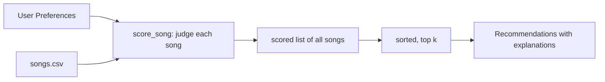

# Music Recommender Simulation

## Project Summary

This project builds a small content-based music recommender system in Python that loads a catalog of songs from a CSV file, accepts a user taste profile as input, and scores every song against that profile using a weighted rule set. The top-scoring songs are returned as recommendations with a plain-language explanation of why each was chosen.

The system mirrors how real-world recommenders like Spotify's "Radio" feature work at a conceptual level, comparing song attributes to a model of what the user likes and ranking results by similarity.

---

## How The System Works

This recommender uses **content-based filtering**, comparing the attributes of each song to the user's stated preferences and assigning a numeric score. The ranking step calls the scoring function on every song, then sorts the full list by score (highest first) and returns the top `k` results.

**Song features used:**
- `genre` — the broad musical category (pop, rock, lofi, edm, etc.)
- `mood` — the emotional feel of the track (happy, chill, intense, sad, etc.)
- `energy` — a 0.0–1.0 scale of loudness and intensity
- `acousticness` — a 0.0–1.0 scale of acoustic vs. electronic instrumentation

**User profile fields:**
- `genre` — the user's preferred genre
- `mood` — the user's target mood
- `energy` — the user's target energy level (0.0–1.0)
- `likes_acoustic` — boolean flag for acoustic preference

**Algorithm Recipe (scoring one song):**

| Rule | Points |
|---|---|
| Genre matches user preference | +2.0 |
| Mood matches user preference | +1.0 |
| Energy proximity | `1.0 - abs(song_energy - target_energy)` (0.0–1.0) |
| Acoustic bonus (if `likes_acoustic` and `acousticness > 0.6`) | +0.5 |

**Data flow:**



---

## Getting Started

### Setup

1. Create a virtual environment (optional but recommended):

   ```bash
   python -m venv .venv
   source .venv/bin/activate      # Mac or Linux
   .venv\Scripts\activate         # Windows
   ```

2. Install dependencies:

   ```bash
   pip install -r requirements.txt
   ```

3. Run the app:

   ```bash
   python -m src.main
   ```

### Running Tests

```bash
pytest
```

---

## Experiments You Tried

Three distinct user profiles were tested against the catalog.

**Pop / Happy** (genre=pop, mood=happy, energy=0.8)
- Top result: Sunrise City (Score: 3.98): genre + mood + near-perfect energy match
- Second: Gym Hero (Score: 2.87): genre match but no mood match (intense, not happy)
- The genre weight (2.0) strongly anchors the top results to pop tracks.

**High-Energy Rock** (genre=rock, mood=intense, energy=0.9)
- Top result: Storm Runner (Score: 3.99): all three factors matched precisely
- Second: Fade to Black (Score: 2.82): genre match, but sad mood and lower energy
- The system cleanly distinguished rock from other high-energy genres (EDM, pop).

**Chill Lofi** (genre=lofi, mood=chill, energy=0.35, likes_acoustic=True)
- Top result: Library Rain (Score: 4.50): genre + mood + energy + acoustic bonus
- Third result was still lofi (Focus Flow) despite not being chill mood, because genre weight dominated.

**Weight-shift experiment:** Doubling the energy weight caused Spacewalk Thoughts (ambient, energy=0.28) to climb into the top 3 for the lofi profile even without a genre match. This showed that genre weight at 2.0 is what keeps results genre-coherent, since pure energy proximity can otherwise override category entirely.

---

## Limitations and Risks

- **Tiny catalog:** With only 20 songs, genre-matching can dominate. A user with genre=country will only ever see 1 country song in their top results.
- **No context awareness:** The system doesn't know if it's morning, a workout session, or a study session, so it always applies the same static weights.
- **Binary genre matching:** "indie pop" and "pop" are treated as completely different genres even though a pop fan would likely enjoy both.

---

## Reflection

Read and complete `model_card.md`:

[**Model Card**](model_card.md)

Building this recommender revealed that the core challenge isn't the math but what you decide to measure, since choosing which features to weight encodes assumptions about what "good music" means that can be wrong or unfair in ways invisible until you test edge cases. The genre weight of 2.0 means a mediocre genre match will always outscore a near-perfect mood and energy match in a different genre, which isn't necessarily what a real listener would want.
